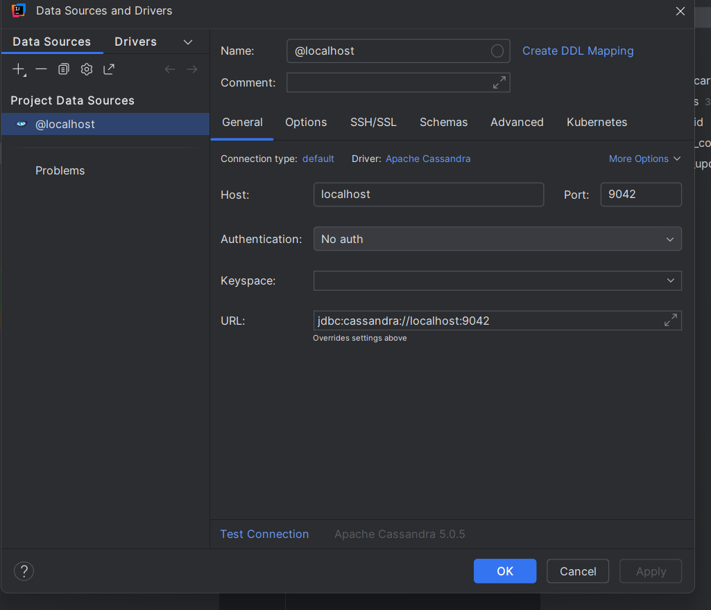

## Tinyurl Backend
Goal of this application is to demonstrate a working backend api with capabilities 
Also, dependency and configuration of each below capabilities
- openapi spec (auto generation of api spec .yml file)
- actuator
- security (api key)

## Project Generate Via Springboot Starter 
- https://start.spring.io/#!type=maven-project&language=java&platformVersion=3.5.5&packaging=jar&jvmVersion=24&groupId=com.hk.prj&artifactId=tinyurl-api&name=tinyurl-api&description=Project%20to%20serve%20as%20tinyurl%20backend&packageName=com.hk.prj.tinyurl-api&dependencies=web

## All Modifications in [pom.xml](pom.xml)

- Actuator Dependency to enable actuator at link - <basepath>/<context-path>/actuator

```xml
    <dependency>
        <groupId>org.springframework.boot</groupId>
        <artifactId>spring-boot-starter-actuator</artifactId>
    </dependency>
```
 - in this app - http://localhost:8080/api/v1/actuator

- Swagger Dependency - <basepath>/<context-path>/swagger-ui.html

```xml
    <dependency>
        <groupId>org.springdoc</groupId>
        <artifactId>springdoc-openapi-starter-webmvc-ui</artifactId>
    </dependency>

```
 - in this app - http://localhost:8080/api/v1/swagger-ui/index.html

- [openapi.yml](src/main/resources/openapi.yml) to generate autostub of all API interfaces 
```xml
<plugin>
                <groupId>org.openapitools</groupId>
                <artifactId>openapi-generator-maven-plugin</artifactId>
                <version>7.8.0</version>
                <executions>
                    <execution>
                        <goals>
                            <goal>generate</goal>
                        </goals>
                        <configuration>
                            <inputSpec>
                                ${project.basedir}/src/main/resources/openapi.yml
                            </inputSpec>
                            <generatorName>spring</generatorName>
                            <apiPackage>openapi.api</apiPackage>
                            <modelPackage>openapi.model</modelPackage>
                            <supportingFilesToGenerate>
                                ApiUtil.java
                            </supportingFilesToGenerate>
                            <configOptions>
                                <delegatePattern>true</delegatePattern>
                                <useSpringBoot3>true</useSpringBoot3>
                            </configOptions>
                        </configuration>
                    </execution>
                </executions>
            </plugin>
```

and This dependency 

```xml
    <dependency>
        <groupId>org.openapitools</groupId>
        <artifactId>jackson-databind-nullable</artifactId>
        <version>0.2.1</version>
    </dependency>
```

## Apache Commons Dependency to Generate Random 6 digit short code for a URL
```xml
    <dependency>
        <groupId>org.apache.commons</groupId>
        <artifactId>commons-lang3</artifactId>
        <version>3.18.0</version>
    </dependency>
```

## References
https://www.baeldung.com/java-openapi-generator-server


## Cassandra in local via docker 
- docker pull cassandra:latest
- docker network create cassandra-net
- docker run --rm -d --name cassandra --hostname cassandra --network cassandra-net -p 9042:9042 cassandra

## connect to cassandra via intellij


## install docker-desktop
https://docs.docker.com/desktop/setup/install/windows-install/

WSL is required to run docker-desktop in windows.
if you get this error with WSL - “Error code: Wsl/CallMsi/REGDB_E_CLASSNOTREG”
Then use this link for WSL - https://github.com/microsoft/WSL/releases/ 
